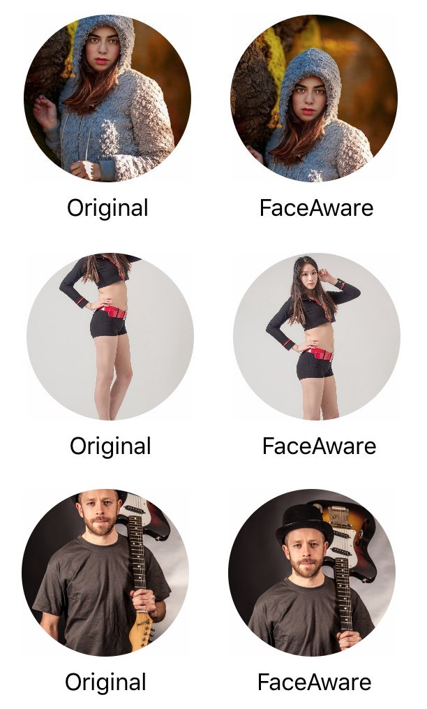

FaceAware for Android
========
[](https://opensource.org/licenses/Apache-2.0)
[](https://jitpack.io/#memishood/FaceAware-Android)
<br>
FaceAware is zoom library to face automatically for Android.<br>


<p>This library uses <a href="https://developers.google.com/ml-kit/vision/face-detection/android">ML Kit</a> for detecting the face. Your application size will be increased around 800kb after you add this library into your project.</p>

## Setup
```
allprojects {
    repositories {
        ...
        maven { url 'https://jitpack.io' }
    }
}
```
```
dependencies {
    def faceAwareVersion = "4.0.0"
    implementation "com.github.memishood:FaceAware-Android:$faceAwareVersion"
}
```

## AndroidManifest.xml
This step isn't required but it is nice to have that describing which ML-Kit model will be exactly used in your application.
You might want to see example manifest file in <a href="app/src/main/AndroidManifest.xml/">here</a>
```xml
<meta-data
    android:name="com.google.mlkit.vision.DEPENDENCIES"
    android:value="face" />
```

## Layout XML

```xml
<ee.webmob.library.FaceAware
    android:id="@+id/faceAware"
    android:layout_width="250dp"
    android:layout_height="250dp"
    android:layout_gravity="center"
    android:src="@drawable/image"
    app:facePadding="20"
    app:shape="rounded"
    app:borderRadius="20dp" />
```
## Kotlin

```kotlin
        faceAware.setImageResource(R.drawable.test)
        // or
        faceAware.setImageDrawable(ActivityCompat.getDrawable(this,R.drawable.test))
        // or
        Glide.with(this).load(uri).into(faceAware)
        // or
        Picasso.get().load(uri).into(faceAware)
```

### Properties

| Property     | Type       | Default Value | Description                                                  |
|--------------|------------|---------------|--------------------------------------------------------------|
| facePadding  | double     | 0             | Padding that will be given after focusing on the face        |
| shape        | enum       | rounded       | Whether it will be circle or rounded                         |
| borderRadius | dimension  | 0dp           | Border radius for rounded shape                              |

-------------------
## For better understanding

